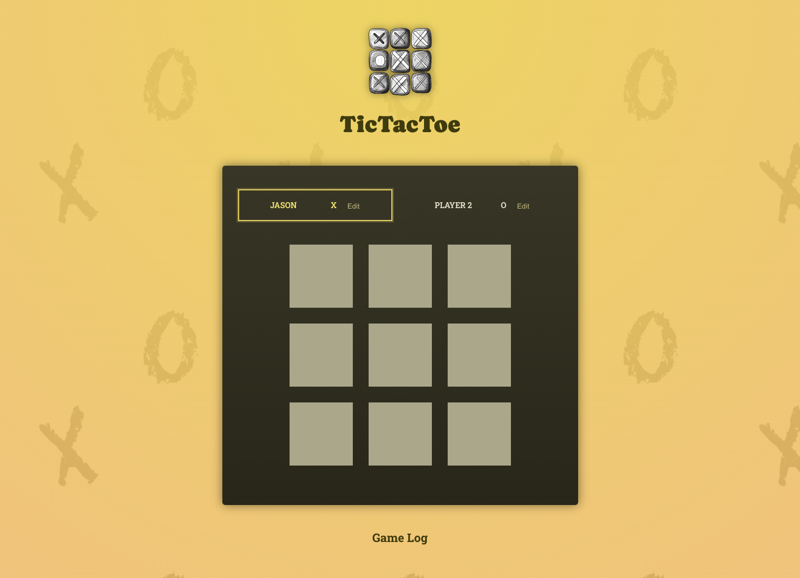

# TicTacToe Game


Welcome to the TicTacToe game built with React! This project is a simple yet interactive implementation of the classic TicTacToe game, allowing two players to compete against each other on a 3x3 grid. The game dynamically tracks the state of the board, handles player turns, and determines the winner or if the game ends in a draw.

## Features

- **Two-Player Mode:** Play with a friend locally.
- **Custom Player Names:** Players can set their names, which are displayed when a player wins.
- **Dynamic Board State:** The game board updates in real-time as players make their moves.
- **Winner Detection:** The game detects when a player wins or when the game ends in a draw.
- **Restart Game:** Players can easily restart the game after a win or draw.

## Demo


## Installation

To run this project locally, you'll need to have Node.js installed. Follow these steps:

1. **Clone the repository:**

   ```bash
   git clone https://github.com/Breedlove-Jason/TicTacToe.git
   ```

2. **Navigate to the project directory:**

   ```bash
   cd TicTacToe
   ```

3. **Install dependencies:**

   ```bash
   npm install
   ```

4. **Start the development server:**

   ```bash
   npm start
   ```

   The game should now be running at `http://localhost:3000/`.

## Project Structure

```bash
TicTacToe/
├── public/
├── src/
│   ├── components/
│   │   ├── GameBoard/
│   │   │   ├── GameBoard.jsx
│   │   ├── GameOver/
│   │   │   ├── GameOver.jsx
│   │   ├── Log/
│   │   │   ├── Log.jsx
│   │   ├── Player/
│   │   │   ├── Player.jsx
│   ├── App.jsx
│   ├── index.js
│   ├── winningCombinations.js
├── .gitignore
├── package.json
├── README.md
```

- **App.jsx:** The main component that manages the state and logic of the game.
- **Player.jsx:** Component for displaying and editing player names.
- **GameBoard.jsx:** Component for rendering the TicTacToe grid.
- **GameOver.jsx:** Component for displaying the game over message and restart button.
- **Log.jsx:** Component for displaying the history of turns.
- **winningCombinations.js:** Contains the predefined winning combinations for the TicTacToe grid.

## How to Play

1. **Set Player Names:** Click on the "Edit" button next to each player name to customize it.
2. **Make Moves:** Players take turns clicking on the grid to place their symbol (X or O).
3. **Win or Draw:** The game will automatically detect when a player has won or if the game ends in a draw. A message will display the result.
4. **Restart:** Click the "Restart Game" button to start a new game.

## Contributing

Contributions are welcome! If you find any issues or want to add new features, feel free to open an issue or submit a pull request.

## License

This project is licensed under the MIT License.

## Contact

If you have any questions or feedback, feel free to reach out:

- **GitHub:** [Breedlove-Jason](https://github.com/Breedlove-Jason)

---

**[View the project on GitHub](https://github.com/Breedlove-Jason/TicTacToe.git)**

```

This README provides a comprehensive overview of the project, installation instructions, and how to play the game. Let me know if you'd like any changes!